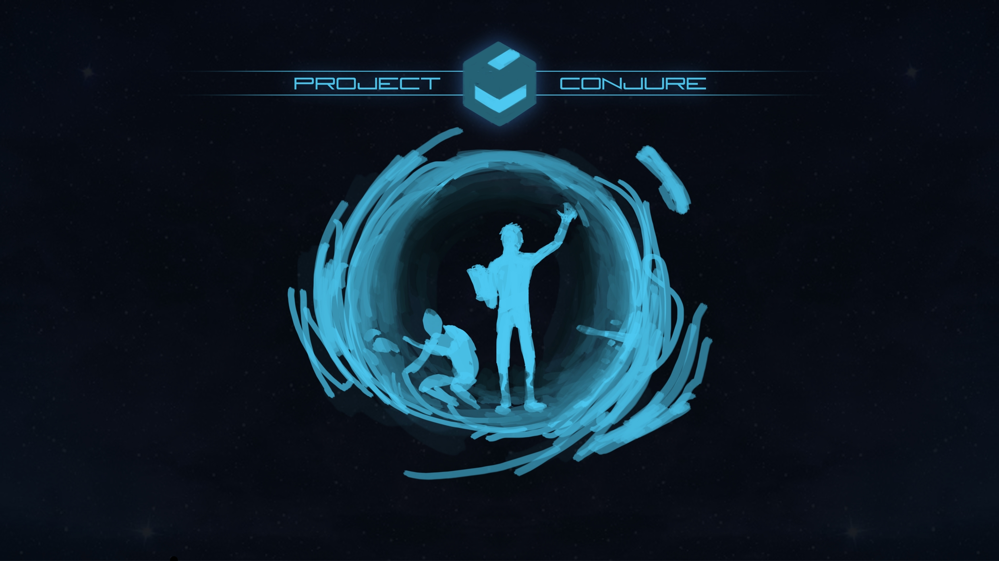
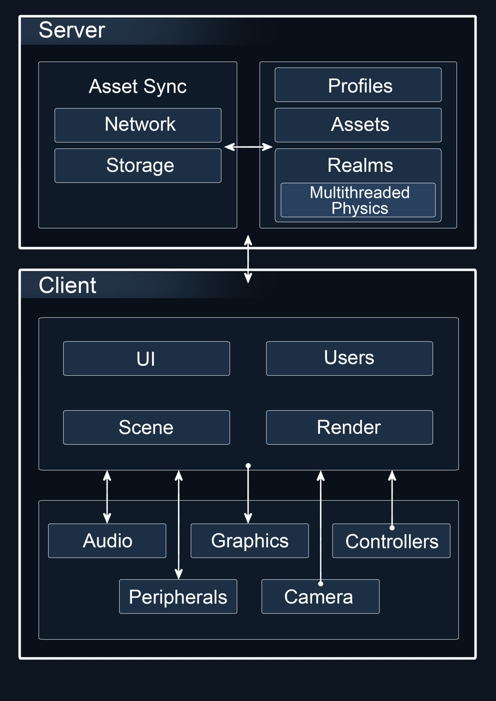

# Conjure

[#ProjectConjure](https://info.conjure.world/)

*Disclaimer:* This is a work in progress - ideas, context and implementation details may and will change

*Disclaimer:* This repo is in the middle of a migration as I figure out how best to organise Conjure & AssetSync




Read about AssetSync & Conjure [here](https://medium.com/@joshfield999)

[Join the conversation on discord!](https://discord.com/invite/ExBxEN2)

## Architecture


## Conjure Progress Goals 2020 Q4

- [x] Migration to AssetSync
- [ ] Basic realm object system working on DHTs
- [ ] Video Conferencing

## Conjure Progress Goals 2021 Q1

- [ ] Profile system (DIDs)
- [ ] Launch test network
- [ ] v0.1 for API / Toolkit

## Deploys

[Semi-stable Prototype Snapshop](https://conjure.world/)

[Current Dev Build](https://dev.conjure.world/)

## Run locally
Make sure you have git, node and yarn (or npm) installed

```	
git clone https://github.com/hexafield/assetsync
cd assetsync/
yarn conjure
```	

# AssetSync

~ *Synchronising the metaverse* ~

## [Asset Sync](packages/AssetSync)

For your assets - data & payments

## [Peer Sync](packages/PeerSync)

Provides a simple interface for sending buffers, requests and events across a messaging context

## [Socket Sync](packages/SocketSync)

For connecting nodejs with the browser with websockets

## [Worker Sync](packages/WorkerSync)

For connecting workers to the DOM

## [World Sync](packages/WorldSync)

A context agnostic wrapper for your virtual worlds

## [Contributing](CONTRIBUTING.MD)

Please read the [contributing document](CONTRIBUTING.MD) if you would like to contribute!

## Other Links

Follow me on [YouTube](https://www.youtube.com/channel/UCZ-gYU_8R-EEFzVY09UyVDQ)

Follow me on twitter https://twitter.com/hexafield and https://twitter.com/conjureworld

Support me here https://ko-fi.com/joshfield